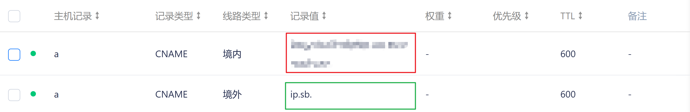
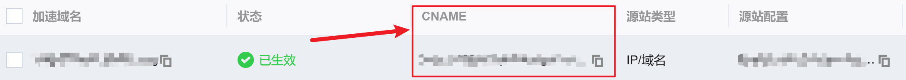
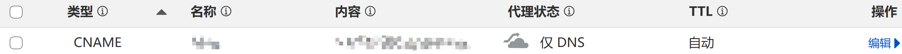
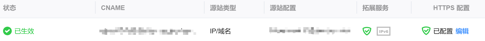

## 事先声明

本教程下面操作仅针对想给网站套上eo免费证书的人，如果不想，直接给网站添加cname指向 `cneo-oceancf.fenliu.072103.xyz`即可（分流网站由[b站二叉树树](https://space.bilibili.com/325903362)提供）

## 准备工具

1. 一台电脑
2. 一个已经托管到cf和eo的域名

## 开始吧！

1. 首先注册任何带有dns分流解析的dns网站，本教程以dnspod为例
2. 托管一个域名（建议为二级域名，以fl.114514.com为例）
3. 然后添加以下解析：



红框部分填写你的eo cname：



绿框部分填写cf cdn ip网站，推荐网站：

```
time.cloudflare.com
shopify.com
time.is
icook.hk
icook.tw
ip.sb
japan.com
malaysia.com
russia.com
singapore.com
skk.moe
www.visa.com
www.visa.com.sg
www.visa.com.hk
www.visa.com.tw
www.visa.co.jp
www.visakorea.com
www.gco.gov.qa
www.gov.se
www.gov.ua
www.digitalocean.com
www.csgo.com
www.shopify.com
www.whoer.net
www.whatismyip.com
www.ipget.net
www.hugedomains.com
www.udacity.com
www.4chan.org
www.okcupid.com
www.glassdoor.com
www.udemy.com
www.baipiao.eu.org
cdn.anycast.eu.org
cdn-all.xn--b6gac.eu.org
cdn-b100.xn--b6gac.eu.org
xn--b6gac.eu.org
edgetunnel.anycast.eu.org
alejandracaiccedo.com
nc.gocada.co
log.bpminecraft.com
www.boba88slot.com
gur.gov.ua
www.zsu.gov.ua
www.iakeys.com
edtunnel-dgp.pages.dev
www.d-555.com
fbi.gov
```

4. 最后在你博客的dns解析页面添加cname指向刚刚的域名即可（如a.fl.114514.com）



5. 成功！


